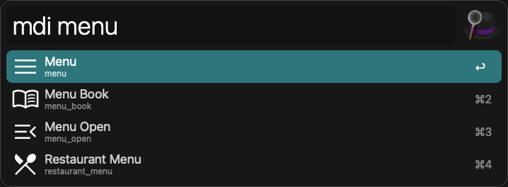

# Search Material Symbols icons (Outlined)

一個用於查詢 `Material Symbols icons` 的工作流，可自訂查詢關鍵字 (預設為`mdi`)

## 使用方法

先在 Workflow 列表中找到此工作流，右側 Workflow 的視圖區域上方，在顯示工作流名稱的下面有個 `Configuare Workflow`，先調整一下設定

1. Search Keyword: 觸發此 Workflow 的關鍵字 (預設:`mdi`)

```bash
mdi menu
```


